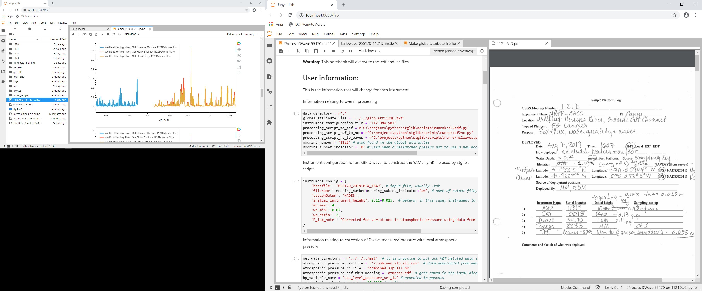

# Processing example using the NRPP CACO experiment data

### Purpose
To provide an example how to use python to process data from raw binary out of an instrument.  We hope this example will help USGS data processors and high performance computing folks to understand our needs and our processes.

### Motivation
We would like to standardize how time series data are handled across the Coastal and Marine Geology program, and eventually like to tap the power of cloud computing for these tasks.  

Data is ultimately published here:  https://stellwagen.er.usgs.gov/

Our conventions and standards for the data are described here:  https://woodshole.er.usgs.gov/pubs/of2007-1194/

### Status
One instrument type for one deployment set of several sites is shown here, with a typical hierarchy of directories and supporting information such as field notes and ancillary data.

Directories are structured as:
* Experiment short name
	* mooring number (may or may not include several deployments)
		* mooring deployment (this tier exists if one mooring has several deployments)
			* instrument

At the instrument level is where the raw data files are, fresh from the instrument.  These are packed binary files in proprietary formats specific to each isntrument, determined by the isntrument manufacturer.  Some publish their binary formats and some do not.  These files are typically larger than what even git lfs can support, and are thus not provided here.

Processing is performed by Jupyter Notebooks.  One advantage to notebooks is to combine text, code and plots, thus elminating the need for "data processing sheets" which we used to use to track processing

Here is a screen capture of a data processor's ideal workspace, acheive in Jupyter-lab with two active instances where one can see processing of an individual instrument, field or isntrumentation notes, and and overview plot of the data for all the sites.

### QA/QC 
As we move to the python world for our workflows, important information still exists over on our old SVN repository wiki.  Here are some significant pages there:
* Things to check before submitting data for review:  https://cmgsoft.repositoryhosting.com/trac/cmgsoft_m-cmg/wiki/preBBVcheck
* Creating a new netCDF file based on an existing template:  https://cmgsoft.repositoryhosting.com/trac/cmgsoft_m-cmg/wiki/schema2newfile